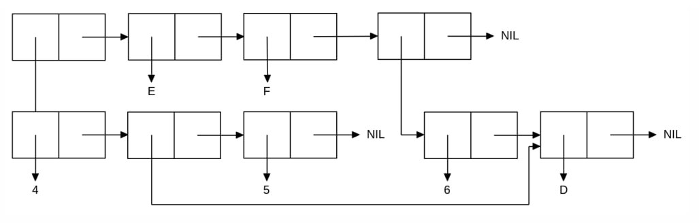

<p align="center"><b>МОНУ НТУУ КПІ ім. Ігоря Сікорського ФПМ СПіСКС</b></p>
<p align="center">
<b>Звіт з лабораторної роботи 1</b><br/>
"Обробка списків з використанням базових функцій"<br/>
дисципліни "Вступ до функціонального програмування"
</p>

<p align="right"> 
<b>Студент</b>: 
<em> XXXXXXXXXXXXXX КВ-12</em></p>

<p align="right"><b>Рік</b>: <em>2024</em></p>

## Загальне завдання

```lisp
;; Пункт 1 (створення списку)
CL-USER> (setq my-list (list 'A 1 '(B 2) 'C  (list)))
(A 1 (B 2) C NIL)

;; Пункт 2 (отримання голови списку)
CL-USER> (car my-list)
A

;; Пункт 3 (отримання хвоста списку)
CL-USER> (cdr my-list)
(1 (B 2) C NIL)

;; Пункт 4 (отримання третього елемента списку)
CL-USER> (third my-list)
(B 2)

;; Пункт 5 (отримання останнього елемента списку)
CL-USER> (car (last my-list))
NIL

;; Пункт 6 (Використання предикатів ATOM та LISTP)
;;ATOM
CL-USER> (atom 1)
T
CL-USER> (atom 'a)
T
CL-USER> (atom '(1 2))
NIL

;;LISTP
CL-USER> (listp 0)
NIL
CL-USER> (listp '(A B))
T
CL-USER> (listp my-list)
T

CL-USER> (listp nil)
T

;; Пункт 7 (Використання інших предикатів)

;;null
CL-USER> (null nil)
T
CL-USER> (null '(1 2 3))
NIL

;;evenp
CL-USER> (evenp 2)
T
CL-USER> (evenp 3)
NIL

;;numberp
CL-USER> (numberp 15)
T
CL-USER> (numberp '(A B C))
NIL

;; Пункт 8 (Об'єднання списку із підсписком)

CL-USER> CL-USER> (append (third my-list) my-list)
(B 2 A 1 (B 2) C NIL)
```

## Варіант 8
<p align="center"></p>

### Лістинг команди конструювання списку та результат її виконанння
```lisp
CL-USER> CL-USER> (let ((x (list 6 'd))) 
     (list (list 4 (cdr x) 5) 'E 'F x))
((4 (D) 5) E F (6 D))
```